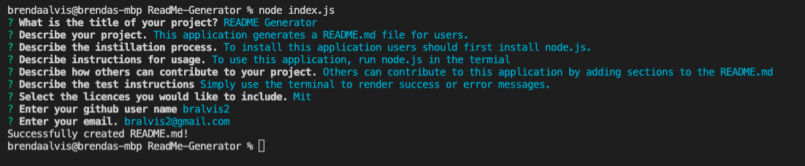
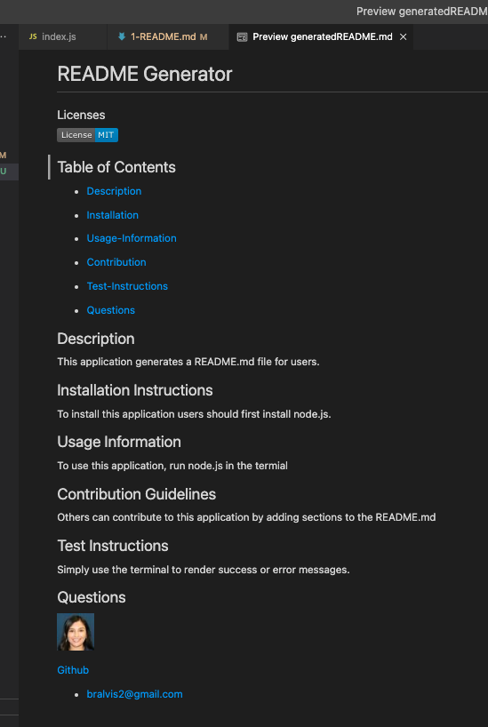

# ReadMe-Generator

### Licenses

 ## Description
 
 This application is designed with the purpose of maximizing efficincy in creating README.md files so that creators can focus on their projects. The generated ReadMe.md includes well thought out aspects including licenses, and a dynamic table of contents. 
 
 ## How To

 [DEMO](https://drive.google.com/file/d/1cI44ed8lKlEUCbP9EA0pvH045d9IPF5I/view)

 To use this application, users should have node.js installed. Additionally, users should install the npm Inquirer package. This application generates the README.md from the terminal command-line. 

 * Step one: Open the terminal and type 'node index.js'.

* Step two: Answer the prompts.

* Step three: Open the generated RREADME.md

 ## Credits & Resources
 I used many examples from the UT resources provided in class and github resources.
